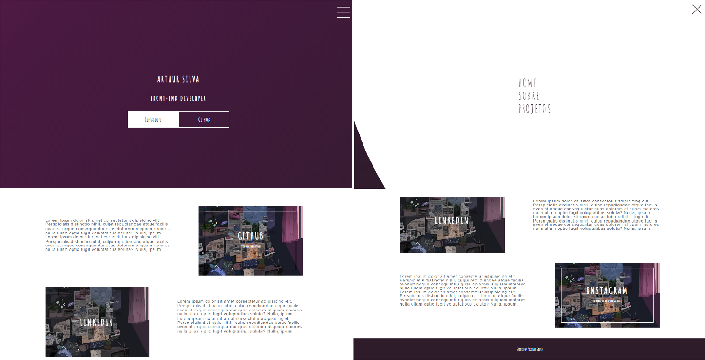

<h1 align="center"> 
    DIO-animations-aulas
</h1>

  <a href="#-About">About</a>&nbsp;&nbsp;&nbsp;|&nbsp;&nbsp;&nbsp;
  <a href="#-Project">Project</a>&nbsp;&nbsp;&nbsp;|&nbsp;&nbsp;&nbsp;
  <a href="#-Technology">Technology</a>

    

<h5 style="text-align: center"> Thank you for see </h5>

## 📚 About

Esse repositório é dedicado em base em exércicios na realização exércicios do Projeto: **Desenvolvendo um menu hamburguer e morphing menu com CSS Transitions** da plataforma Digital Inovation One. Onde foi ministrado por Gabriela Pinheiro Professora e Front-End Engineer, em Outubro de 2020. O projeto tem como princiapal foco trabalhar com animações e a utilização de _@Keyframes_ no projeto final mostrando diferentes possibilidades de _transições_.

Para ter acesso a este conteúdo, acesse [DIO]([DIO | Codifique o seu futuro global agora](https://web.dio.me/lab/desenvolvendo-um-menu-hamburguer-e-morphing-menu-com-css-transitions/learning/0b8fbfe7-3b69-4a0f-bb86-9f2b826c7731))

## 🚀 Technology

O projeto foi desenvolvido a partir das tecnologias:

- *HTML5*
- *CSS3*

## 📚 About

This repository is dedicated, based on exercises, in carrying out the Project's exercises: **Developing a hamburger menu and morphing menu with CSS Transitions** from the Digital Inovation One platform. It was taught by Gabriela Pinheiro Professora and Front-End Engineer, in October 2020. The main focus of the project is to work with animations and the use of _@Keyframes_ in the final project showing different possibilities of _transitions_.

*To access this content, go to [DIO]([DIO | Codifique o seu futuro global agora](https://web.dio.me/lab/desenvolvendo-um-menu-hamburguer-e-morphing-menu-com-css-transitions/learning/0b8fbfe7-3b69-4a0f-bb86-9f2b826c7731))*

## 🚀 Technologies Used:

*The project was developed based on technologies:*

- *HTML5*
- *CSS3*

--------------

Developed by :atom_symbol: [**Arthur Silva**]([arthursj (ArthurSilva) (github.com)](https://github.com/arthursj))
